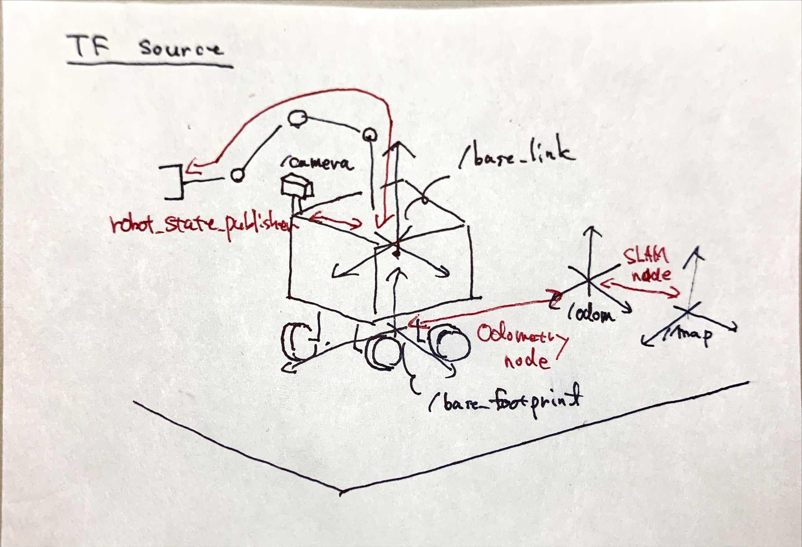

tf_lessons
====

ROSのTFの利用に関しての個人的な知見について記したレポジトリ

## tf overview
tfはROSを用いたシステムにおいて，分散した各ノードで
座標系ツリーと時間に対する補間を管理するためのライブラリである．
tfとtf2があるが互換性があるので新規にtfを用いたコードを扱う場合はtf2を用いればよい．
ただ，古い方のtfでは座標系管理部分とROSとのインターフェースの部分が混在してたが，
tf2ではそれらが分割されてそれぞれROSパッケージ "tf2", "tf2_ros" となっている．
大抵の場合は"tf2_ros"パッケージを呼べば十分であり，"tf2"パッケージを用いる場合は
C++でtf2::Quaternionのような型や座標変換のユーティリティコードを単独で呼ぶくらいだと思われる．
ただ，そのような座標変換はEigenを使うほうがネット上で情報を多く見つけやすく，
tf2での型とEigenの型を変換するtf2_eigenのなどのパッケージがあるのでEigenを用いたほうが良いだろう．

tfを扱うにあたっては，
* 座標系の変化には管理される期間がある
* (基本的に)各座標系が一つのツリーの要素になっている
* 座標系ツリーの中にループする部分がない

ということに留意する必要がある．

tfによる座標変換と補間は，ある時刻のある座標系間の座標変換をbroadcast/listenすることで行われる．
broadcast/listenは実態はpublish/subscribeであり，座標変換情報をtopic経由で出力/入力することを指す．
listenerにはデフォルトで過去10秒分の座標系変換情報がバッファに保持されており，
所望の時刻のある座標系間の変換を，そのデータを用いて時間補間により計算することができる．
そのため，古すぎる時刻，座標系ツリーにデータ中に途切れのある変換の指定，
そして補間のためには時刻的に2点で挟む必要があるので最新データでも過去になる
今現在の時刻の変換が得ることができないという特徴がある．
(座標変換は保存されたデータの内挿で計算され外挿では行われない)

ただ，実用上は常に座標系ツリーの中に既に固定された座標系変換というものを考えたほうが都合がよい．
そのために/tf_staticというtopicが用意されており，固定された変換はここにbroadcastされるのが基本となっている．
これは周期的にtopic /tf_staticにpublish(broadcast)されているわけではなく，
このtopicに対するsubscribe(listener)が現れるたびにpublishするという実装になっている．
詳しくはtf2_ros packageのソースstatic_broadcast_publisher.cppを見てみると良いだろう．
たいてい無駄ではあるが，固定された座標変換を周期的に/tfにbroadcastし続けても結果としては殆ど同じである．

以下では，実際にtfを実行しながら解説する．
```
$ # cloneして自分のROS workspaceに本パッケージをビルドすること
$ roscore
$ rviz -d tf_lessons/rviz/lesson.rviz #別端末で実行
```
すること．

## Broadcast and Listen for static TF
`lesson1.cpp`は簡単なtfをbroadcastする例である．
"world"座標系から"base_link"座標系への変換をbroadcastしている．

`lesson1.cpp`はlesson1というnode名であり，引数を付けて次の通り実行する．
```
$ rosrun tf_lessons lesson1 static
```
このとき，`tf2_ros::StaticTransformBroadcaster`を用いて，/tf_staticに座標変換をbroadcastしている．
RViz上にその座標変換がTF RViz pluginにより表示されているはずだ．
次のコマンドを実行してみよう．
```
$ rostopic echo /tf_static
$ rostopic hz /tf_static
```
最初のコマンドでは，一度だけ座標変換の内容が表示されるはずだ．
そして2つ目のコマンドでは，`new_message`と表示されつづけるはずである．
最初のコマンドを何度繰り返してもtopicの内容が一度だけ表示される．
これは/tf_staticが周期的にbroadcast(publish)されているのではなく，
それをlisten(subscribe)するものが現れたときに，
lesson1 nodeによって一度だけbroadcastされているからである．

次に`tf_lesson2.cpp`を実行する．
これは，tfをlistenする例であるが，
100Hz周期で現在時刻，1秒前，10秒前，最新利用可能時刻でのtfをlistenしてその成否を表示し，
更に1秒前，10秒前，最新利用時刻の指定で得た"world"から"base_link"への座標変換を
それぞれ赤色，緑色および青色のマーカーでRViz上に表示させるnodeである．
```
$ rosrun tf_lessons lesson2
```
実行すると最初だけ失敗するがすべての時刻においてtfがlistenできることがわかるだろう．

## Broadcast and Listen for dynamic(non-static) TF
前章で起動したRVizやroscore，nodeがそのままなら一度すべて終了させて，
roscore, RVizを起動しよう．
以下では"world"，"base_link"といった座標系の名前などを再利用するが，
Static, 非Staticなtfで同じ変換が混在する場合，RVizの表示などに不具合が生じる可能性があるようだ．

今回，lesson1 nodeは引数を変えて実行する．
```
$ rosrun tf_lessons lesson1 non-static
```
このとき，`tf2_ros::TransformBroadcaster`を用いて，/tf topicに座標変換をbroadcastしている．
一秒間に一回同じ変換をbroadcastすることを11回繰り返している．
RViz上でTF pluginにより座標変換が表示されるが，薄くなって消えていくのがわかるだろう．
非staticなtfは古いものは捨てられるtfの仕様のためかこのような表示が行われるようにこのpluginは実装されている．
(PluginをOn/Offすれば再び表示されるが...)

既に述べたようにtf listenerはデフォルトで過去10秒分のbroadcastされた座標変換の履歴を有しており，
それに基づき補間することで所望の座標変換を計算する．
一度lesson1 nodeを終了させて，lesson2 nodeを起動させたあとに再びlesson1 nodeを起動させてみよう．
lesson2 nodeの端末への出力から次のようなことが読み取れるはずだ．

最初に最新利用時刻"maybe-available", そして1秒前，10秒前の順にlistenが成功して，
時間が経つと1秒前のtfのlistenに失敗，そして10秒前のlistenに失敗する．
最新利用時刻のlistenはその後も可能であるが，その情報の時刻がlesson1 nodeによって
最後にbroadcastされたものであり，現在時刻"current-time"のlistenは常に失敗している．

これらから，tfのlisterが保持している10秒分のバッファの利用のされ方が理解できるであろう．

次はバッファから計算された座標変換が時間的に補間されたものであることを確認しよう．
lesson1 nodeを終了して，lesson3 nodeを起動する．
```
$ rosrun tf_lesson lesson3
```
lesson3 nodeでは"world"座標系に対して"base_link"座標系が1秒毎に36度だけ離散的に回転する座標変換を
broadcastしている．
lesson2 nodeも起動して座標変換をlistenした結果をマーカで可視化しよう．
このnodeによりRViz上で次のようなことが読み取れるはずだ．

最新利用時刻の座標変換を示す赤のマーカが"base_link"を指すtfによく追従しており，
1秒前の変換を示している緑のマーカがそのすぐ後ろを追従している．
10秒前の変換を示す青いマーカは時折消えることもあるが，"base_link"と一致しながら
連続的に動いているのがわかる．

lesson3 nodeは1Hzでtfをbroadcastしているので，10Hzでlistenしている
lesson2 nodeで赤いマーカは十分に追従できている．
10秒前の座標変換はlisterのバッファ的にギリギリの部分なのでlistenできたりできなかったりするために，
青いマーカは断続的に現れている．
また，緑と青のマーカは連続移動している．
"base_link"座標系は1秒に一回36度分回転しているだけなので正十角形の頂点を移動しているだけだが，
その頂点を移動している間の座標変換を時間的に補間することで
緑と青のマーカは十角形の外接円の円周上を移動している．

今回はlesson3 nodeが1Hzで/tfにbroadcast(publish)しているために
赤いマーカは"base_link"にきれいに追従したが，
tfのlistenはtopicのsubscribeと同じであるので，/tfの周波数が増えると
追従するのが難しくなる．lesson3 nodeのコードを書き換えて試してもらいたい．

また余談ではあるが，lesson2 nodeでは
`tf2_ros::TransformBroadcaster`で座標変換をbroadcastしているが，
例えば`tf2_ros::StaticTransformBroadcaster`を使ってbroadcastすると，
/tf_staticをlistenするlistenerは座標系の補間を行わずに常に最新の座標変換のみを返す．
コードを書き換えてlesson2 nodeがpublishするmarkerの様子を見てみると理解が深まるだろう．

## static\_transform\_publisher node
`tf2_ros::StaticTransformBroadcaster`を利用したlesson1 nodeのように，
ある固定の座標変換を/tf_staticにbroadcastし続ける汎用的なnodeがtf2_ros packageにツールとして用意されており，
static_transform_publisherという．
次のように座標関係を指定することで実行できる．
```
$ rosrun tf2_ros static_transform_publisher 1 2 3 0 0 0 world base_link
```
指定している数値はxyzとrpyだがquaternionでもできる．
このnodeはtfで表現する座標系ツリーの中でせいぜい1つ2つの変換をbroadcastするのに用いることが多い．

static\_transform\_publisherは一つのnodeで一つの座標変換を扱っている．
staticなtfなので新しくsubscriberが現れた場合にしかbroadcastしないが，
同時に複数のstatic\_transform\_publisherを実行するとどうなるかlesson4.launchを実行して確かめてみよう．
```
$ roslaunch tf_lessons lesson4.launch
$ rostopic hz /tf_static # 別端末で
$ rostopic bw /tf_static # 別端末で
```
lesson4.launch では数珠つなぎにつながる座標変換を22個のstatic_transform_publisherで実行している．
RViz上に座標系が並んで表示されているのが見えるはずだ．
`rostopic hz` や `rostopic bw`の結果を見ると瞬間的に/tf_staticの周波数が増えたりネットワークを占める
バンド幅が瞬間的に増大していることがわかる．

static_transform_publisherでのbroadcastは周期的でないので問題になることはまず無いが，
無駄にnodeを実行しても仕方がないし，tfによってROSのtopicが飛ぶネットワークに
このように負荷がかかることがこの事例から理解できるだろう．
非staticなtfについてのこのような場合については次章でも確かめていく．

## Too many broadcasting node
ここからはroscoreとRVizを再び実行し直してから始める．

lesson5 nodeは`tf2_ros::TransformBroadcaster`を用いて非staticなtfをbroadcastするnode である．
引数を指定してある1つの座標変換をbroadcastするか複数の座標変換を同時にbroadcastするか設定することができる．
```
$ rosrun tf_lesson lesson5 onetf world base_link 0.5 # single tf by one node
$ rosrun tf_lesson lesson5 multitf world 20 0.5 # multiple(twenty) tf by one node
```
lesson5 nodeには100Hz周期でbroadcastさせている．これは`rostopic hz /tf`で調べられるだろう．

このlesson5 nodeを使って数珠つなぎの座標変換を複数のnodeを使ってbroadcastする場合と，
1つのnodeでbroadcastする場合の違いについて調べる．
複数のlesson5 nodeを同時に起動するために，lesson6.launchを用いる．
lesson6.launchではlesson5 nodeの引数に`onetf`を指定し，同時に22個起動して，
数珠つなぎの座標系変換をtfにbroadcastするように記述してある．
```
roslaunch tf_lessons lesson6.launch
```
lesson5 nodeでは100Hzで/tf topic にbroadcast(publish)しているはずだが，
`rostopic hz /tf`を実行すると/tfの周期が約2200Hzになっていることに気づくはずだ．

100Hzでpublishするnodeが独立に22個存在しているので結果的に約2200Hzのtopicになってしまっていることがわかる．
実際のセンサなどのnodeは100Hz以上で更新されることが多く，
考慮せずにtfをbroadcastするnodeを増やすと周波数は大きくなるこのような状況になってしまうだろう．
このような状況だと，各nodeのlisten自体が間に合わなくなったり，
割合低い周波数でbroadcastするSLAMのような他のnodeがあると，
その分のtfをlistenできなくなる場合が存在する
\[[参考](https://garaemon.github.io/ros/2014/12/31/ros.html)\].

次はlesson5 nodeの引数に'multitf'を指定して，複数の座標変換を同時にtfにbroadcastしてみる．
```
rosrun tf_lessons lesson5 multitf world 22 0.5
```
lesson6.launchと同様に22個の"座標変換"がbroadcastされているがnodeは1つだけである．
ここでは一度に22個の座標変換をbroadcastしている．
`rostopic hz /tf`を実行すると，100Hzになっていることがわかる．
同様の結果が，より効率よく行われている．
`rostopic bw /tf`の結果も参考になるだろう．

あまり無いとは思うが，早い動作を考えるときに
tfの時間補間をするという仕様上，各nodeのtfのbroadcastの遅れなどを考える状況もでてくるかもしれない．
lesson5 のコメント部分を外してtfに動きを付けて，同じtfの内容でも/tf topicの周波数の違いで
RVizの表示がどう異なるか試してみて考察してみてほしい(ただこの辺は各々の環境の違いがでるかもしれない).

実際のロボットのシステムでは複数の局地座標系を扱わざるを得ない．
そのために役立つURDFによる記述とrobot_state_publisher nodeについて次章にて述べる．

## URDF + robot_state_publisher
一般にロボットのtfのbroadcastに関わる事例としては
* SLAM
* GPS
* コンパス
* IMU(velocity)
* カメラ
* 関節

が考えられる．
これらによる座標変換の中には固定であったり計算や観測の結果として座標変換をするものもあるが，
その殆どがURDFによる記述とrobot_state_publisher nodeを使うことで1つのtfにまとめてbroadcastすることができる．

URDFによってロボットの各リンクの座標系とそのジョイントが記述される．
1自由度で駆動するジョイントについては，/joint_state topicにsensor_msgs/JointState型の
メッセージをpublishすることでrobot_state_publisherが対応したtfをbroadcastしてくれる．
固定のジョイントについては/joint_state にpublishする必要はなく，
robot_state_publisherはその部分の座標変換を/tf_staticにbroadcastする．
あまりないと思うが球体ジョイントのような多自由度ジョイントを扱う場合は
そのtfのbroadcastを実装しなければならない状況であるだろう．

GPS, コンパス，IMU, カメラがロボットのlinkに接続される場合は固定の座標変換であり，
ある基準の座標系に対してSLAM, GPS, コンパスがその位置・姿勢を与える場合は
可変する座標変換が必要となる．
後者のtfのbroadcastについてはrobot_state_publisherの範囲外である．

tfのbroadcast元については，下図のような状況が代表的な例である．
robot_state_publisherは/map -> /odom -> /base_footprint -> /base_link -> ...とつながる
座標系ツリーのうち，/base_footprint以下の座標変換の殆どを扱う．


## Keep one tf-tree
tfで扱われる座標系ツリーは基本的に常に一本かつ, ループする部分が無いことが求められる．
以下ではこの条件を保つ努力のために，共通認識になっている座標系名と，
対症療法的なtfの修繕について述べる．

### Representative name of frames
tfで扱われる座標名(frame_id)については任意に設定することができるが，
共通的に使われるものがいくつか存在する．
これはあくまでも推奨でありROSを扱うための絶対的な規範ではないが追従したほうがよいだろう．
\[[REP-105](https://www.ros.org/reps/rep-0105.html)\])が参考になるかもしれない．
いくつかの名前について所感を述べる．

* /world : シミュレーションのように位置に不確かさがないときの原点に用いられる場合が多い(気がする，個人の意見)
* /map : 地図の原点を指す座標系．実機でlocalizationをする場合はたいてい座標系のrootになる．
* /odom : IMUや車輪によるオドメトリの原点を指す．理想的には/mapと一致するがSLAMによる誤差修正で/mapとずれる．
* /base_footprint : 平面移動だけを考えるとき，base_linkに対してz=0のように地面での座標を意味しているようだ
* /base_link : ロボット本体の中心を指す座標系．ロボットそのものの座標系のrootの名前として使われる．

tfによる座標系は一本のツリーであり，ループしてはならないという制限があり，
これらの名前に関しては殆どの場合，以下のように接続されている．
```
(root)/world -> /map -> /odom -> /base_footprint -> /base_link -> /link1
                                                               -> /link2 -> /link2-1
                                                                         -> /link2-2
                                                               -> ...
```
この制限はある座標系から他の座標系(例えば/worldから/link2-2)の変換を考えるとき，
ある一本道が存在することを保証するためのものである．

以下のようにどこかが切断されていると，二本以上のツリーになってしまう．
```
(root)/world -> /map
====
(root)/base_footprint -> /base_link -> /link1
                                    -> /link2 -> /link2-1
                                              -> /link2-2
                                              -> ...
```

ループがあるとは以下のような状況である．
```
(root)/world -> /map -> /odom -> /base_footprint -> /base_link -> ...
                                                 -> /odom
```

これらのバグはtfのbroadcastの周期によってはrqt_tf_treeといったtfの可視化ツールではわかりにくいことがあり，
直接/tf, /tf_static topicを読んで確認したほうが発見しやすいかもしれない．
数秒分の`rostopic echo /tf`の結果をログに保存して`grep`コマンドなどを使いながら読むといいだろう．

### Connect fragments of coorinates in ROSBAG data
ROSにおいてデータを扱う際にtfによる座標関係が整備されていることが望ましい．
RVizなどを用いて全座標系について関係が設定できているかどうか確認すべきである．
しかし，ROSを用いてロボットの実験を行い後からrosbagで解析しようとする際，
センサ周りでtimestampが何故か狂っていたり，tfによる座標関係がつながっていないなどの
問題が(少なくとも個人的には)見受けられることが時折ある．

基本的にはROSBAGのAPIが整備されているので，内部のtopicなどを直接APIで読み，所望の形に書き換えればよい．
ただ，情報不足で他のデータを目視しながら修正する場合や容量の大きいbagファイルの場合，
rosbagを再生しながら適宜コードを書いて様子を確かめたいはずだ．
ロボットの現在位置をSLAMで出力するといった計算の成否によってtfが出力されるかどうか決まる状況もあるが，
その時はシステム全体のデバッグとして仮想的にロボットの位置をtfでbroadcastなどするべきだ．

ここではそういう場合の対症療法的なtfのbroadcastに関してのtipsをまとめる．

#### Wrong message meader
一昨日行った実験の解析をするnodeを今日実行してみたら何故か動かず，
その時よく各messageのタイムスタンプを見るとわずかにずれていることに気づくということがある．
`roscore`を実行したあとすぐ`rosparam set /use_sim_time`を設定してからrosbagや各種nodeの起動をしたり，
`rosbag play --clock` のように--clockオプションの付けることで修正できるはずだ．
解析nodeのなかに`ros::Time::now()`などが含まれていることを考えて，時間設定を適切に行わなければならない．

センサの出力を扱うROS nodeを実行したとき，センサ側の時刻設定に失敗するなどして，
メッセージのヘッダー部分のタイムスタンプの値に間違ったものを記録してしまうことがある．
典型的な例がmsg.header.stamp = 5のように数値が小さい場合だ．ROSの時間はunix時間で表現されているので，
実機が入る場合はたいてい1300000000(これは2011/3/13 16:06:40 JST)より上のはずだ．

他にもheaderの失敗としてframe_idが適切に設定されてない(空だったりする)状況がある．
これはセンサのdriver nodeでframe_idを引数で渡すことを失念していたり，
ROS parameter経由での設定を失敗していたりするのが原因だと思われる(個人的な経験だが…)．

headerの内容を修正する場合には，ROSBAGのAPIでbagfileそのものを書き換えるほかにも
nodeを作ってsubscribeして修正した後に別topicにpublishし直しても良いだろう．
C++やpythonのソースを書かなくとも[topic_tools](http://wiki.ros.org/topic_tools/transform) packageの
transform nodeを用いてその場で次のように別topicにPublishし直すことができる．
```bash
$ rosrun topic_tools transform /in_topic /out_topic geometry_msgs/PoseStamped \
'geometry_msgs.msg.PoseStamped(header=std_msgs.msg.Header(seq=m.header.seq, \
stamp=rospy.get_rostime(), \
frame_id="my_new_frame"), \
pose=m.pose)' \
--import geometry_msgs std_msgs rospy
```
上記はframe_idを"my_new_frame"に変更して，stampを現在の時刻に変更している．
rosbag 再生時に--clockオプションを付けておけばおおよそ正しい時刻になるだろう．

また，headerのないtopicのpublishした時刻を知りたいといった場合は，
rosbagにはpublishした時刻まで別に保存してあるのでAPIを叩いて取得するなどすればよい．

#### Add TF broadcaster
RGBカメラやGPSをtfの座標系に組み込むことが忘れられがちなように思われる．
RGB画像さえあれば良かったり，正確な外部キャリブレーションが面倒だったりすることや，
GPSの緯度経度の値しか使わないのでtfにしなくても良いという意見もあるだろう．
ただ，カメラは大体の値でもいいからtfを設定しておくとRViz Camera Pluginで
MarkerやPointCloudなど他の情報をRGB画像に重ねて表示したりできるし
(RViz Image Pluginはtfを利用しない)，ROSのpackageで言えばgeodesyを使えば
平面座標系であるUTM座標系への変換が容易であるので，RTKを導入しSLAMの評価のためのGround Truthとして
tfを通じて比較するなどの利用法が考えられる．

また，UAVに付けたカメラのジンバルなどは座標系を回転させるものだが，
制御するnodeによってはtfをbroadcastせず，topicで内部状態を出力するものもあるようだ．
代わりにgeometry_msgs/Vector3Stamped でジンバルのオイラー角をPublishしていたりする．
Quaternionに変換してカメラ角度にすることや, ジンバル機構をURDFで記述して/joint_state topicに
角度情報を送るなどしてtfとして扱うことが考えられる．

これらの情報を後からtfとしてbroadcastするには，
固定の座標変換の場合はstatic_transform_broadcast nodeを使ったり，
状況に応じて変化する場合はnodeを書いてtopicをsubscribeしてその内容をtfに書き換えてbroadcastしてやればよい．
tfのAPIはPythonでも使えるようにbindingされているのでlesson7.pyのような簡易なnodeを適宜書いてデバッグしながら
全体の調整を行えば良い．
